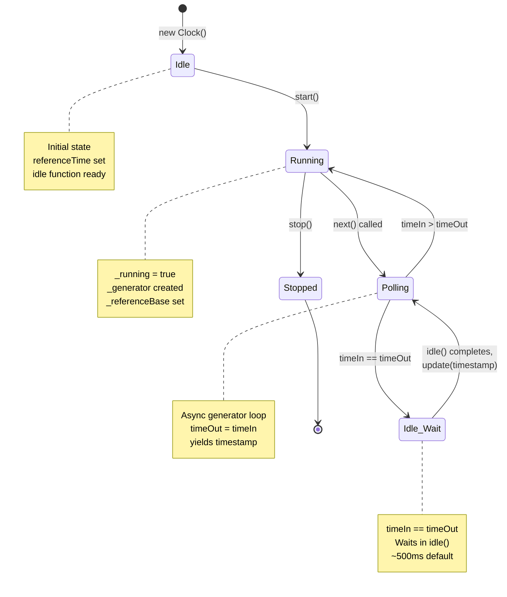

# Clock

## Overview

- Async generator-based timing control
- Tracks time-in and time-out for scheduling
- Supports start/stop and async iteration
- Used by Kafka1 Consumer for message polling

## Clock State Machine

