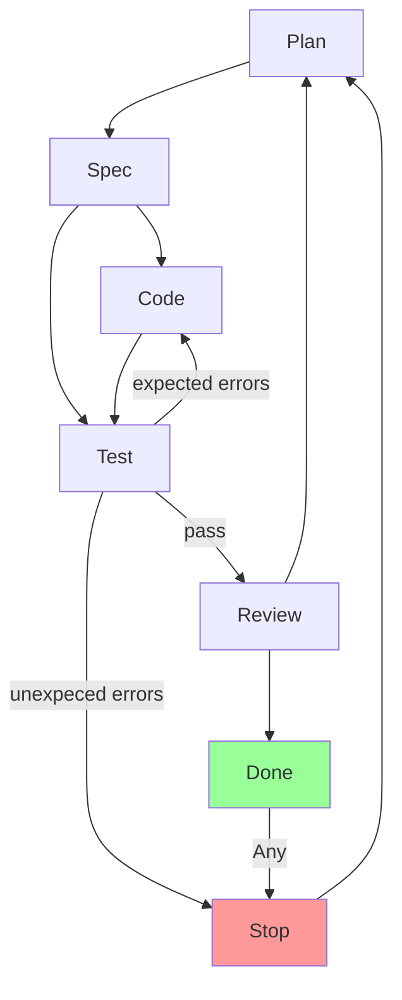

# Coding Process

## Overview

This document describes a collaborative coding process involving two roles: Agent, Human.
Past interactions have revealed that Agent and Human work most productively
when they work together as a Pair Programmning Team on a shared **Task**.

## State Diagram

Each Task comprises one ore more **Actions** to be completed towards a goal.
Each Action has multiple states defined in the State Diagram.
Human/Agent consensus is required for most state transitions.

### States

- **Plan**: Refine the proposal into formal specification
- **Spec**: Formal specification. Agent and Human agree on what will be coded.
- **Code**: Write source code and matching test code
- **Test**: Run tests for new code. Run tests for old code.
- **Review**: Human reviews code for maintainability and best practices.
- **Done**: Human approves. Action complete.
- **Stop**: Testing revealed unexpected behavior or wrong assumptions. Stop to discuss and Plan.

## Key Rules

1. **Consensus is required** state transitions require consensus unless otherwise specified

2. **CodeSource branches by scope**: Public API changes (add/remove/change features) → TestNew. Internal changes (bugfixes) → TestOld.

3. **Stop**: Avoid FAFO. Stop and discuss.

4. **Done is not final**: Even after Done, anomalies can appear. Loop back to Plan.
