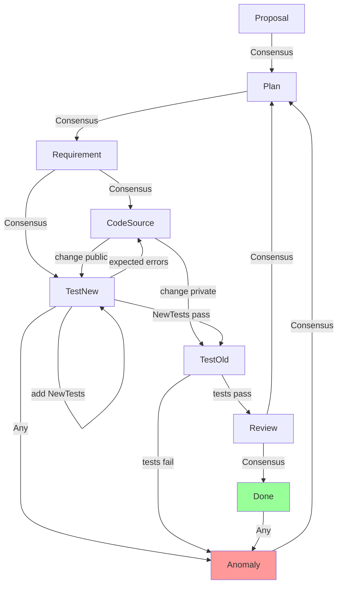

# Coding Process

## Overview

This document describes a collaborative coding process involving two roles: Agent, Human.
Past interactions have revealed that Agent and Human work most productively
when they work together as a Pair Programmning Team on a shared **Task**.

## State Diagram

Each Task comprises one ore more **Actions** to be completed towards a goal.
Each Action has multiple states defined in the State Diagram.
Human/Agent consensus is required for most state transitions.

### States

- **Proposal**: Action identified. Agent proposes what needs doing.
- **Plan**: Agent and Human refine the proposal into a workable plan.
- **Requirement**: Formal specification. Agent and Human agree on what will be coded.
- **CodeSource**: Write code. Route depends on scope: public API changes → TestNew first. Internal changes → TestOld first.
- **TestNew**: Write and run tests for new code. Must pass before checking regressions.
- **TestOld**: Run existing test suite. Must pass before review.
- **Review**: Human reviews code for maintainability and best practices.
- **Done**: Human approves. Action complete.
- **Anomaly**: Testing revealed unexpected behavior or wrong assumptions. Agent and Human discuss, decide next step (back to Plan or CodeSource).

## Key Rules

1. **Consensus on major transitions**: Proposal → Plan, Plan → Requirement, Requirement → code, Anomaly → Plan, Review → Done. Agent cannot unilaterally advance.

2. **CodeSource branches by scope**: Public API changes (add/remove/change features) → TestNew. Internal changes (bugfixes) → TestOld.

3. **TestNew is mandatory**: Agent writes and runs tests for new code before checking regressions. Cannot skip.

4. **Anomaly stops solo work**: Agent does not guess at fixes. Agent and Human discuss together before proceeding.

5. **Done is not final**: Even after Done, anomalies can appear. Loop back to Plan.
