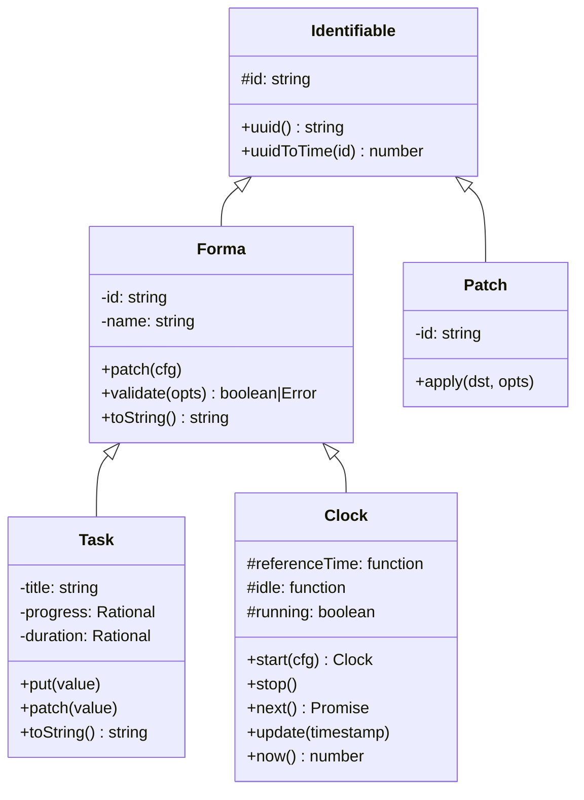

# Identifiable

## Overview

- Provides UUID v7 generation and validation
- Immutable `id` property with getter
- Static methods: `uuid()`, `uuidToTime()`

## Class Hierarchy

## Features

1. **Automatic UUID v7 Generation**
   - Creates time-ordered UUIDs using `uuidV7()`
   - Immutable private field `#id`
   - Exposed via enumerable getter property

2. **UUID Validation**
   - Validates UUID format
   - Verifies UUID version 7

3. **Time Extraction**
   - `uuidToTime(id)` converts UUID v7 to timestamp
   - Extracts first 12 hex digits as milliseconds
