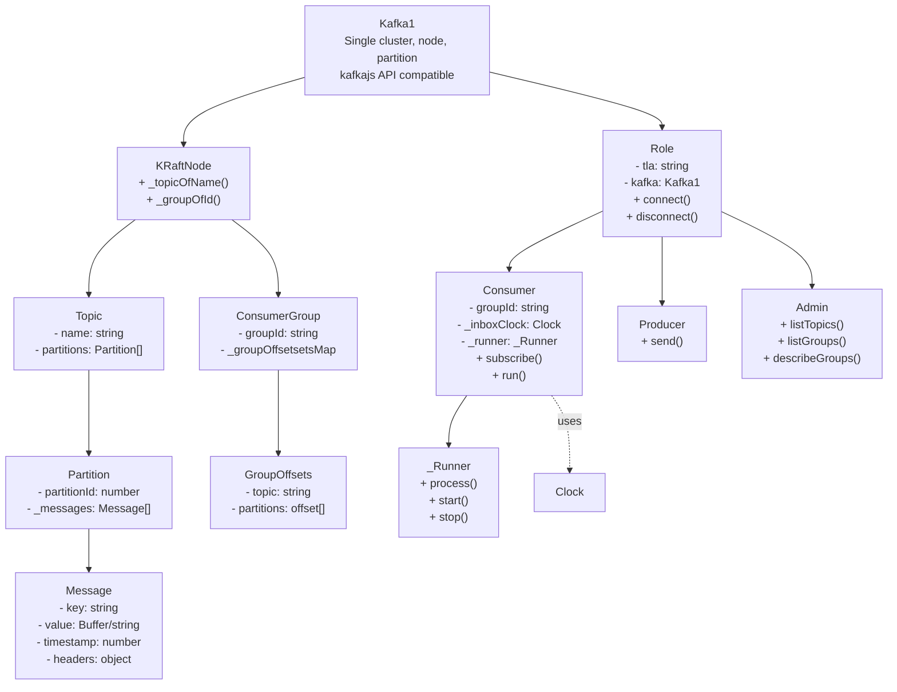
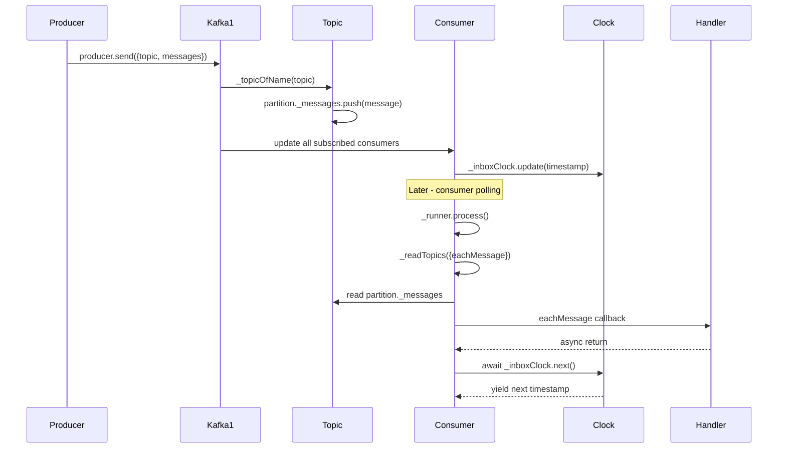

# Kafka1 (Mock Kafka)

## Overview

- Single-cluster, single-node, single-partition in-memory Kafka
- Compatible with kafkajs API subset
- **Consumer**: Subscribes to topics, reads messages via eachMessage callback
- **Producer**: Sends messages to topics/partitions
- **Admin**: Lists topics/groups, describes groups
- **Clock-based polling**: Uses Clock for async message consumption

## Architecture

## Message Flow

