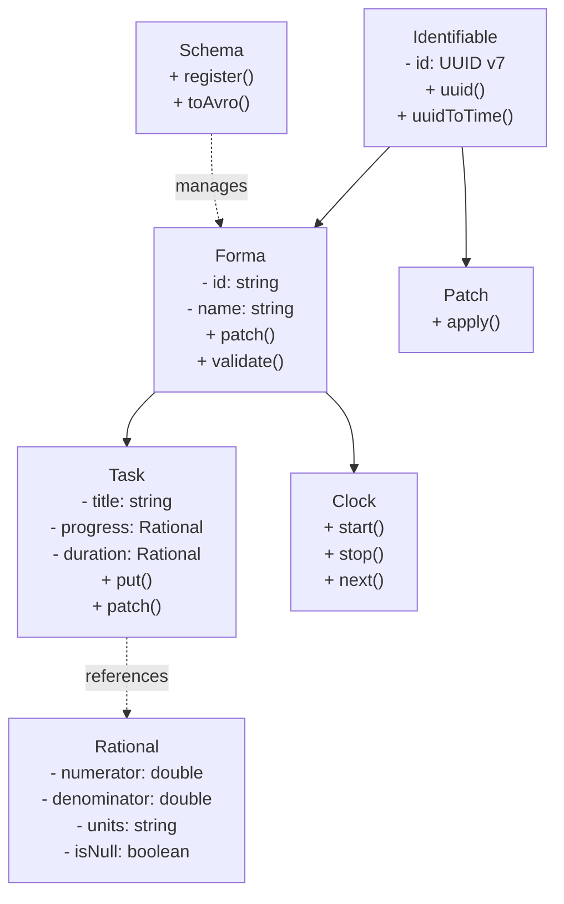
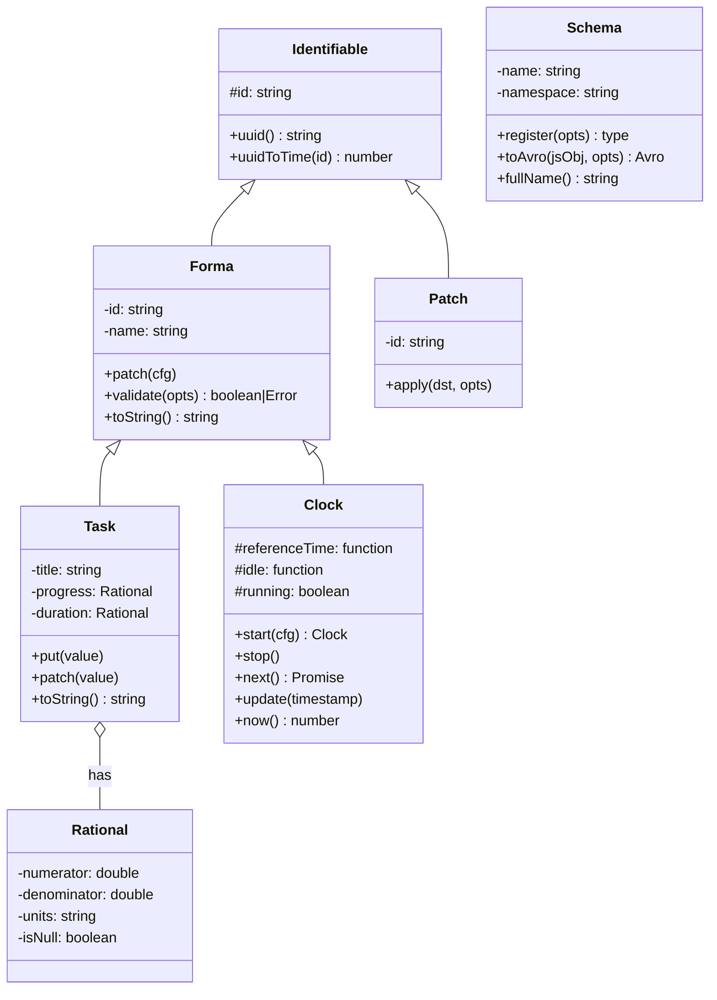
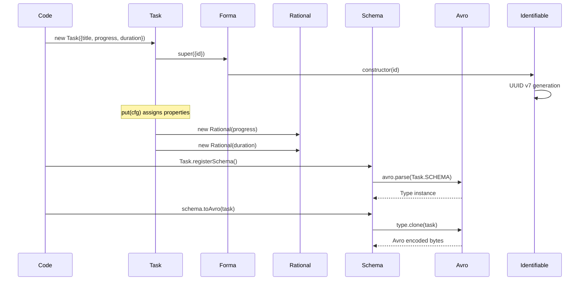

# Nameforma Architecture

## Component Diagram




## Class Hierarchy



## Data Flow Diagrams

### Task Creation & Serialization Flow




## Data Models

### Task (Avro Record)
```
{
  name: 'Task',
  type: 'record',
  fields: [
    { name: 'id', type: 'string' },              // from Forma
    { name: 'name', type: 'string' },            // from Forma
    { name: 'title', type: 'string' },
    { name: 'progress', type: 'Rational' },
    { name: 'duration', type: 'Rational' },
  ]
}
```

### Rational (Avro Record)
```
{
  name: 'Rational',
  type: 'record',
  fields: [
    { name: 'isNull', type: 'boolean', default: false },
    { name: 'numerator', type: 'double' },
    { name: 'denominator', type: 'double' },
    { name: 'units', type: 'string' },
  ]
}
```

### Forma (Base Record)
```
{
  name: 'Forma',
  namespace: 'scvoice.nameforma',
  type: 'record',
  fields: [
    { name: 'id', type: 'string' },              // immutable, unique UUID v7
    { name: 'name', type: 'string' },            // mutable
  ]
}
```

## Key Components

### Identifiable
- Provides UUID v7 generation and validation
- Immutable `id` property with getter
- Static methods: `uuid()`, `uuidToTime()`

### Forma
- Base class for identifiable named objects
- Tracks instance counts by prefix
- Supports patching (merging) properties
- Validation of UUID v7 and name prefixes

### Task
- Extends Forma with task-specific fields
- Manages task progress and duration as Rational numbers
- `toString()` formats task status with symbols (`.`, `>`, `✓`)
- `put()` and `patch()` methods for property updates

### Rational
- Extends Fraction from @sc-voice/tools
- Represents fractional values with units (e.g., "1/2 done", "10 s")
- Schema: numerator, denominator, units, isNull flag

### Clock
- Async generator-based timing control for scheduling and polling. See [clock.md](clock.md)

### Schema
- Avro schema registry and management
- Schema parsing via avro-js
- Converts JavaScript objects to Avro format
- Registers schemas with namespace tracking

### Kafka1 (Mock Kafka)
- In-memory Kafka implementation compatible with kafkajs API. See [kafka1.md](kafka1.md)

## Dependencies

```
External:
├── uuid (UUID v7 generation)
├── avro-js (Avro schema parsing/encoding)
└── @sc-voice/tools (Fraction, Text utilities)

Internal:
├── defines.mjs (Debug flags)
└── index.mjs (Public exports)
```
