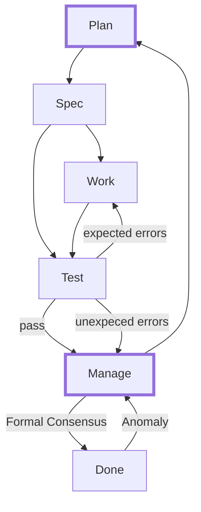

# Tasks and Actions

## Overview

This document defines Agent/Human work on a shared **Task**.
A Task has one or more **Actions** to be completed.
Each Action is stateful with transitions described in the State Diagram.

## State Diagram

Human/Agent consensus is required for all unlabeled state transitions.

### States

States are tactical by default. Strategic states are marked with a thick border.

- **Plan**: Refine the proposal into formal specification
- **Spec**: Formal specification. Agent and Human agree on what will be Work.
- **Work**: Perform required work using best practices
- **Test**: Check work using specification and existing standards 
- **Manage**: Agent consults with Human in Plan Mode
- **Done**: Stable final state

### CLI
`nf help`

