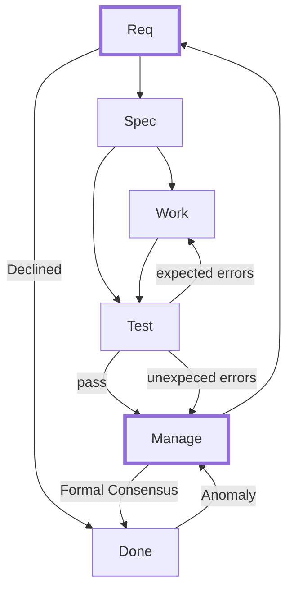

# Tasks and Actions

## Overview

This document defines Agent/Human work on a shared **Task**.
A Task has one or more **Actions** to be completed.
Each Action is stateful with transitions described in the State Diagram.

## State Diagram

Human/Agent consensus is required for all unlabeled state transitions.

Examples of valid state transitions with status notes that describe expected workflow:

| State  | Transition | StatusNote |
|--------|-----------|-------------|
| req    | spec      | Request ok: spec→work→test→done? |
| req    | done      | Request declined: done→manage? |
| spec   | work      | Spec ok: work→test→done? |
| spec   | test      | Add test for new bug: test→work→done? |
| work   | test      | Add test for new feature: test→done? |
| test   | work      | Fix simple errors: work→test→done? |
| test   | manage    | All tests pass: manage→done? |
| test   | manage    | Unexpected test fails: manage→req? |
| manage | req       | Revisit requirements: req→spec? |
| manage | done      | Consensus: done |
| manage | done      | Deferred till next release: done->req? |
| done   | manage    | Revisit requirements: manage→req? |

Note: States req and manage are strategic decision points.

### States

States are tactical by default. Strategic states are marked with a thick border.

- **Req**: Enumerate requirements
- **Spec**: Plan formal specification together
- **Work**: Perform required work using best practices
- **Test**: Verify work meets specification and existing standards 
- **Manage**: Agent consults with Human in Plan Mode
- **Done**: Stable final state

### Action State/Status

The state of a Task is determined by the status of its Actions.
Action status transitions are documented in Action.statusNote.
The statusNote clarifies proposes direction for future state transition:

Example statusNotes:

- **Req**: "req feasible: spec?"
- **Spec**: "spec approved: work?"
- **Work**: "implemented: test?"
- **Test**: "new/old tests pass: done?" - **Test**: "new/old tests fail: manage?"
- **Manage**: "change code or test: work?"
- **Done**: "tested:done"
- **Done**: "req infeasible:done"

### CLI
`nf --help`
