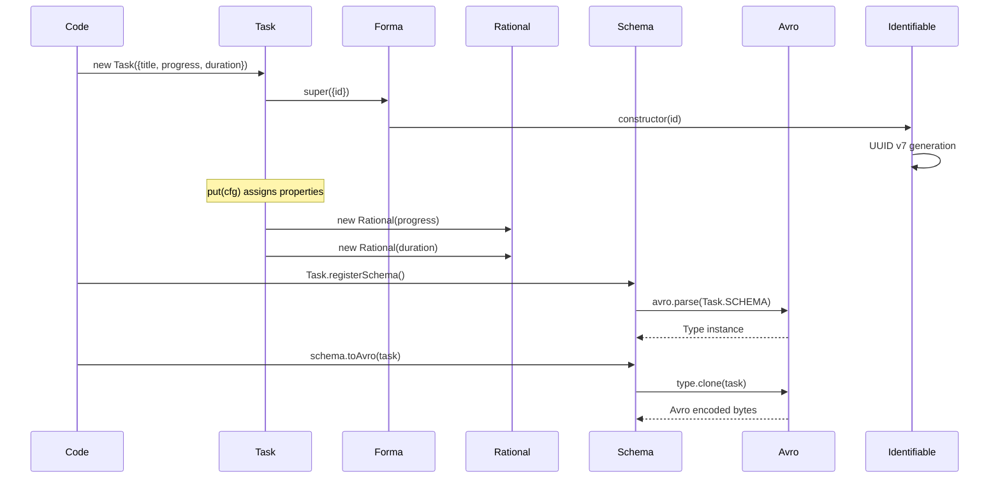

# Task

## Overview

- Extends Forma with task-specific fields
- Manages task progress and duration as Rational numbers
- `toString()` formats task status with symbols (`.`, `>`, `✓`)
- `put()` and `patch()` methods for property updates

## Avro Schema

```
{
  name: 'Task',
  type: 'record',
  fields: [
    { name: 'id', type: 'string' },              // from Forma
    { name: 'name', type: 'string' },            // from Forma
    { name: 'title', type: 'string' },
    { name: 'progress', type: 'Rational' },
    { name: 'duration', type: 'Rational' },
  ]
}
```

## Creation & Serialization Flow


